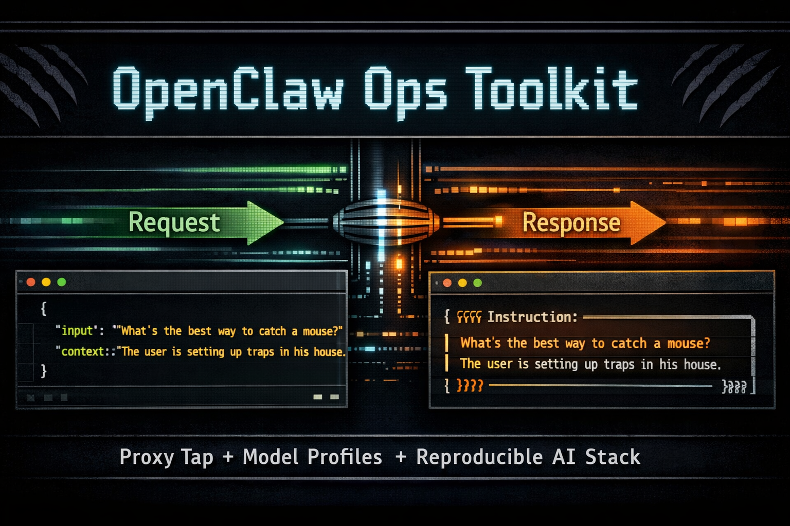

# LLM-Ops-Kit

**Created**: 2026-02-20
**Updated**: 2026-03-03


Operational toolkit for running, deploying, and maintaining a local OpenClaw stack across hosts.



[](#) [](#) [](LICENSE)

- [LLM-Ops-Kit](#openclaw-ops-toolkit)
  - [Why This Repo Exists](#why-this-repo-exists)
  - [Requirements](#requirements)
  - [Recommended Models](#recommended-models)
  - [MLX Audio TTS API (Voice Clone)](#mlx-audio-tts-api-voice-clone)
  - [Quick Start](#quick-start)
  - [Runtime Command Surface](#runtime-command-surface)
  - [Link Management (Single Source of Truth)](#link-management-single-source-of-truth)
  - [Model Profiles](#model-profiles)
  - [Packaging Status](#packaging-status)
  - [Documentation Map](#documentation-map)
  - [Repository Scope](#repository-scope)
  - [Acknowledgements](#acknowledgements)
  - [Contributing](#contributing)
  - [Support This Work](#support-this-work)
  - [Contact](#contact)
  - [License](#license)


## Why This Repo Exists

`LLM-Ops-Kit` is the operator layer around a local OpenClaw install:

- Unified startup/shutdown/status scripts for gateway, proxy, TTS, LLM, and embeddings
- Model profile management (`Qwen3`, `Qwen3.5`, `BGEen`) via one launcher architecture
- Deployment helpers for cross-host sync and runtime link management
- Practical runbooks and changelog-driven operations
- Prompt/template and observability tooling for debugging real runtime behavior

This repo is intentionally focused on **operations and reproducibility**, not raw app source.

## Requirements

- OpenClaw installed and configured on the host
- `llama.cpp` server binary available at `/usr/local/bin/llama-server` (project: <https://github.com/ggml-org/llama.cpp>)
- `mlx-audio` installed for local TTS server (`python -m mlx_audio.server`) (project: <https://github.com/Blaizzy/mlx-audio>)
- Optional but recommended for secret handling: `seckit` (example repo: <https://github.com/unixwzrd/seckit>)
- Bash scripts use `#!/usr/bin/env bash`
- Compatibility target: Bash 3.2+ (macOS system bash), Bash 5+ recommended
- Standard CLI tools: `ssh`, `rsync`, `jq`, `sed`, `awk`, `perl`
- Python helper scripts use `#!/usr/bin/env python` and require Python 3.9+

## Recommended Models

These are the profiles currently documented and validated in this toolkit:

- LLM (chat/tools): `unsloth/Qwen3.5-35B-A3B-GGUF`
  - <https://huggingface.co/unsloth/Qwen3.5-35B-A3B-GGUF>
- TTS (voice cloning): `mlx-community/Qwen3-TTS-12Hz-0.6B-CustomVoice-8bit`
  - <https://huggingface.co/mlx-community/Qwen3-TTS-12Hz-0.6B-CustomVoice-8bit>
- Optional larger TTS model: `mlx-community/Qwen3-TTS-12Hz-1.7B-CustomVoice-8bit`
  - <https://huggingface.co/mlx-community/Qwen3-TTS-12Hz-1.7B-CustomVoice-8bit>

Notes:

- `Qwen3TTS` profile defaults point to the 0.6B CustomVoice model for lower memory use.
- For Qwen3.5 LLM profile details and overrides, see `scripts/models/Qwen3.5.sh`.
- For TTS profile defaults and host/port, see `scripts/models/Qwen3TTS.sh`.

## MLX Audio TTS API (Voice Clone)

`~/bin/tts` and `~/bin/Qwen3TTS` wrap `mlx_audio.server` and expose an OpenAI-compatible endpoint:

- `POST /v1/audio/speech`

Quick clone request:

```bash
AUDIO="$HOME/LLM_Repository/TTS/Samples/Mia-Faith-Sample.wav"
TEXT="${AUDIO%.wav}.txt"
MODEL="$HOME/LLM_Repository/TTS/Qwen3-TTS-12Hz-0.6B-CustomVoice-8bit"
OUT="/tmp/mia-clone.wav"

REF_TEXT="$(cat "$TEXT")"

curl -sS http://127.0.0.1:18081/v1/audio/speech \
  -H 'Content-Type: application/json' \
  -d "$(jq -n \
    --arg model "$MODEL" \
    --arg input "Hey Mike, this is a quick clone check." \
    --arg ref_audio "$AUDIO" \
    --arg ref_text "$REF_TEXT" \
    --arg response_format "wav" \
    '{model:$model,input:$input,ref_audio:$ref_audio,ref_text:$ref_text,response_format:$response_format}')" \
  --output "$OUT"
```

Full setup + troubleshooting guide:

- [MLX_AUDIO_TTS_GUIDE](docs/MLX_AUDIO_TTS_GUIDE.md)

## Quick Start

```bash
# 1) Sync repo to target host (if needed)
~/bin/sync-ops-scripts --delete

# 2) Deploy runtime commands into ~/bin
/usr/local/bin/bash ~/projects/LLM-Ops-Kit/scripts/deploy-runtime-links.sh

# 3) Verify links
/usr/local/bin/bash ~/projects/LLM-Ops-Kit/scripts/verify-runtime-links.sh

# 4) Start services
~/bin/gateway start
~/bin/Qwen3 start
~/bin/BGEen start
~/bin/proxy start
```

## Runtime Command Surface

```bash
~/bin/gateway [start|stop|restart|status]
~/bin/proxy [start|stop|restart|status]
~/bin/tts [start|stop|restart|status]
~/bin/tts-bridge [start|stop|restart|status]
~/bin/Qwen3TTS [start|stop|restart|status|settings|verify|test]
~/bin/Qwen3 [start|stop|restart|status|settings|verify|test]
~/bin/Qwen3.5 [start|stop|restart|status|settings|verify|test]
~/bin/BGEen [start|stop|restart|status|settings|verify|test]
~/bin/modelctl list
~/bin/modelctl status
~/bin/modelctl <ModelProfile> [start|stop|restart|status|settings|verify|test]
~/bin/install-runtime [--source <repo-path>] [--prefix <install-base>] [--bin-dir <bin-dir>] [--no-links]
~/bin/uninstall-runtime [--prefix <install-base>] [--bin-dir <bin-dir>] [--state-file <path>] [--keep-files]
~/bin/openclaw-stack [start|stop|restart|status] [all|gateway|llm|embedding|tts|proxy|models]
~/bin/openclaw-report
```

## Link Management (Single Source of Truth)

Runtime link mappings are centralized in:

- `scripts/runtime-links.manifest`

Both scripts consume this same manifest:

- `scripts/deploy-runtime-links.sh`
- `scripts/verify-runtime-links.sh`

New model launchers are discovered from `scripts/` symlinks to `modelctl`. Regenerate with `scripts/generate-manifest` (also run automatically by `sync-ops-scripts`).

## Model Profiles

Model defaults live under:

- `scripts/models/`
- `scripts/defaults/`

Current profiles:

- `Qwen3` (LLM)
- `Qwen3.5` (LLM, preset + template mode support)
- `BGEen` (embeddings)
- `Qwen3TTS` (TTS via MLX Audio server)

The launcher resolves profile defaults and prints active runtime settings with:

```bash
~/bin/Qwen3 settings
~/bin/Qwen3.5 settings
~/bin/BGEen settings
```

## Packaging Status

This repo currently ships as script-first operations tooling.

A future optional path is to add `pyproject.toml` and package wrappers for installer-driven deployment (`pipx`/`pip`) while keeping shell scripts as the canonical runtime layer.

## Documentation Map

- [DEPLOYMENT_SYNC_RUNBOOK](docs/DEPLOYMENT_SYNC_RUNBOOK.md) — sync/deploy/verify workflow
- [OPERATIONAL_WORKFLOW_PHASE1](docs/OPERATIONAL_WORKFLOW_PHASE1.md) — day-to-day operating workflow
- [PROXY_TAP_RUNBOOK](docs/PROXY_TAP_RUNBOOK.md) — proxy request/response visibility + jq recipes
- [CONTEXT_ARCHITECTURE_PLAN](docs/CONTEXT_ARCHITECTURE_PLAN.md) — context routing/system design
- [CHANGELOG](CHANGELOG.md) — chronological operational changes
- [QUICKSTART](docs/QUICKSTART.md) — fast path setup and startup
- [CONFIGURATION](docs/CONFIGURATION.md) — environment overrides, host/path defaults, and optional `seckit` runtime export workflow
- [SSH_SETUP_RUNBOOK](docs/SSH_SETUP_RUNBOOK.md) — SSH key setup and deployment auth flow
- [TROUBLESHOOTING](docs/TROUBLESHOOTING.md) — symptom-driven fixes
- [ARCHITECTURE](docs/ARCHITECTURE.md) — component and runtime flow overview
- [GLOSSARY](docs/GLOSSARY.md) — core terms used across docs
- [SAFE_PUBLISH_CHECKLIST](docs/SAFE_PUBLISH_CHECKLIST.md) — public pre-publish safety checks
- [Scripts README](docs/scripts/README.md) — per-command script guides
- [MLX_AUDIO_TTS_GUIDE](docs/MLX_AUDIO_TTS_GUIDE.md) — end-to-end MLX Audio setup and voice-clone workflow

Internal planning/docs are kept under `docs/internal/` and are not required for runtime operation.

## Repository Scope

This repo is safe to publish as an ops/project artifact.

Keep private runtime state out of this repo (for example: local sessions, secrets, raw `.openclaw` data, private memory files).

## Acknowledgements

This toolkit depends on excellent upstream work:

- `llama.cpp` for local GGUF inference
- `mlx-audio` for local OpenAI-compatible TTS/STT APIs
- Hugging Face for model and artifact distribution

## Contributing

Issues and PRs are welcome for:

- script hardening
- cross-platform compatibility
- runbook clarity
- model/profile improvements

## Support This Work

If this project saves you time or helps you run local AI infrastructure more reliably, consider supporting independent development:

- [Patreon](https://patreon.com/unixwzrd)
- [Ko-Fi](https://ko-fi.com/unixwzrd)
- [Buy Me a Coffee](https://buymeacoffee.com/unixwzrd)

## Contact

- [unixwzrd@unixwzrd.ai](mailto:unixwzrd@unixwzrd.ai)

## License

Copyright 2026  
[unixwzrd@unixwzrd.ai](mailto:unixwzrd@unixwzrd.ai)

[MIT License](LICENSE)

Permission is hereby granted, free of charge, to any person obtaining a copy of this software and associated documentation files (the "Software"), to deal in the Software without restriction, including without limitation the rights to use, copy, modify, merge, publish, distribute, sublicense, and/or sell copies of the Software, and to permit persons to whom the Software is furnished to do so, subject to the following conditions:

The above copyright notice and this permission notice shall be included in all copies or substantial portions of the Software.
