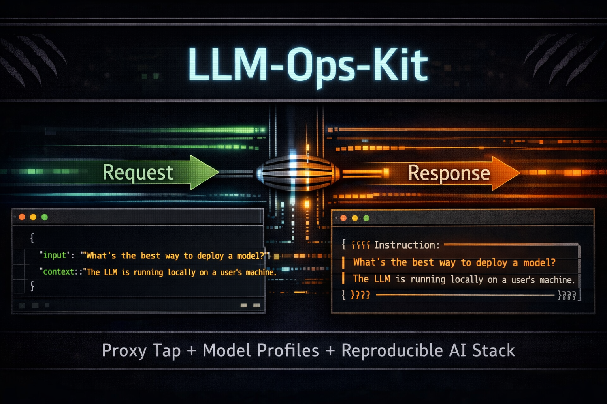

# LLM-Ops-Kit



[](https://github.com/unixwzrd/LLM-Ops-Kit/releases/latest)
[](https://github.com/unixwzrd/LLM-Ops-Kit/actions/workflows/ci.yml)
[](#supported-beta-platform)
[](LICENSE.md)

LLM-Ops-Kit is a macOS-first control plane for models, agents, proxies, bridges, tunnels, and supporting AI services across one computer or a trusted LAN. It coordinates native processes and service managers without replacing them with containers or a cluster scheduler.

`llmops` is the only public command. Components are independently manageable; stacks are dependency groups for coordinated operation. The CLI and Textual console use the same planner, executor, adapters, and configuration model.

Installed commands converge locally to the version and release repository approved by the reconciled `llm-ops-kit` product manifest before dispatch when `auto_update` is enabled. The verified updater changes only the immutable toolkit runtime and re-executes the requested command; it does not restart managed components.

## Supported Beta Platform

- macOS 15 or newer on Apple Silicon or Intel
- GNU Bash available as `bash` in `PATH`
- SSH for remote hosts
- launchd for supervised services

The installer owns its UV-managed Python runtime. It does not require Git, system Python, Conda, or an operator-managed virtual environment. Linux and systemd are experimental and are not supported by this beta.

## Install

Download and verify the installer from the latest published release:

```bash
curl -fsSLO https://github.com/unixwzrd/LLM-Ops-Kit/releases/latest/download/install-llmops
curl -fsSLO https://github.com/unixwzrd/LLM-Ops-Kit/releases/latest/download/install-llmops.sha256
shasum -a 256 -c install-llmops.sha256
bash install-llmops --repository unixwzrd/LLM-Ops-Kit
```

Then create and validate a local configuration:

```bash
~/.local/bin/llmops init --preset single-host
~/.local/bin/llmops doctor --probe
~/.local/bin/llmops --version
```

The release badge at the top of this page shows the current published version. `llmops --version` reports the installed toolkit version. To install a specific release, add `--version <tag>` to the installer command.

The verified release archive contains the application wheel, locked offline dependency wheelhouse, runtime resources, manifest, and checksums. The installer creates an immutable release under `~/.local/llm-ops/releases/`, maintains `current` and `previous`, and exposes `~/.local/bin/llmops`. Use `--minimal` for a CLI-only installation.

## Operate

```bash
llmops status
llmops status <component-or-tag>
llmops component plan restart <component>
llmops component restart <component>
llmops stack status
llmops host list
llmops topology show --component <component>
llmops tui
```

Starting a component starts missing dependencies. Restarting affects only the requested component unless `--cascade` is supplied. Stopping a component with active dependents requires `--force` or `--cascade`.

Status reports lifecycle, health-independent uptime, operator condition, observability, owning host, component and toolkit versions, catalog and configuration identity, authority, drift, and last synchronization where available. `authority-only` means the catalog knows the component but the current account has no authorized observation route; it does not mean the component is stopped.

## Configure And Update

Canonical desired state lives under `~/.config/llm-ops/`. Trusted control hosts consume complete secret-free topology revisions so they can plan and operate the full system; component-only hosts consume role-filtered revisions. Each host selects its revision through an atomic `current-config` link.

```bash
llmops template list
llmops component fields <component>
llmops component configure <component> --set profile.<field>=<value> --plan
llmops component add <id> --template <template> --profile <profile> --stack <stack> --host <host> --plan
llmops config reconcile --all-hosts --plan --json
llmops config reconcile --all-hosts --apply --yes
llmops update --all-hosts --plan --version <version>
llmops update --all-hosts --apply --version <version>
llmops rollback
```

Independent remote edits are reported as drift and are never merged automatically. Runtime updates stage and verify the same artifact on every selected host and roll back hosts changed by the invocation if a later host fails.

Versioned JSON Schema service templates drive CLI validation and Textual forms. A trusted peer forwards schema mutations and the TUI to the designated desired-state authority rather than editing a deployed snapshot.

The Textual editor groups schema fields and treats accepted edits as persistent desired state. **Save** writes without disruption; **Save & Restart** writes and restarts only affected components that are currently intended to run; **Cancel** makes no change. Both save actions show the equivalent CLI command and complete impact plan before confirmation.

## Documentation

- [Quickstart](docs/QUICKSTART.md)
- [Operator checklist](docs/OPERATOR_CHECKLIST.md)
- [Textual console](docs/TUI.md)
- [Status semantics](docs/STATUS.md)
- [Topology views](docs/TOPOLOGY.md)
- [Adapters](docs/ADAPTERS.md)
- [Configuration](docs/CONFIGURATION.md)
- [Service template authoring](docs/TEMPLATE_AUTHORING.md)
- [RTK integration](docs/RTK.md)
- [Migration](docs/MIGRATION.md)
- [Remote operation](docs/DEPLOYMENT_OVERVIEW.md)
- [Upgrade and rollback](docs/UPGRADE_AND_ROLLBACK.md)
- [Architecture](docs/ARCHITECTURE.md)
- [Troubleshooting](docs/TROUBLESHOOTING.md)

## License

See [LICENSE.md](LICENSE.md).
