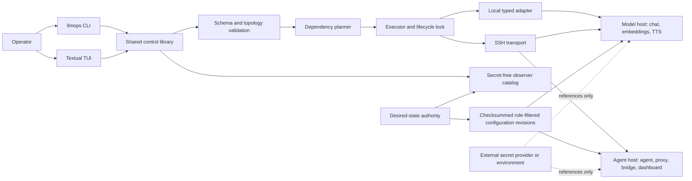
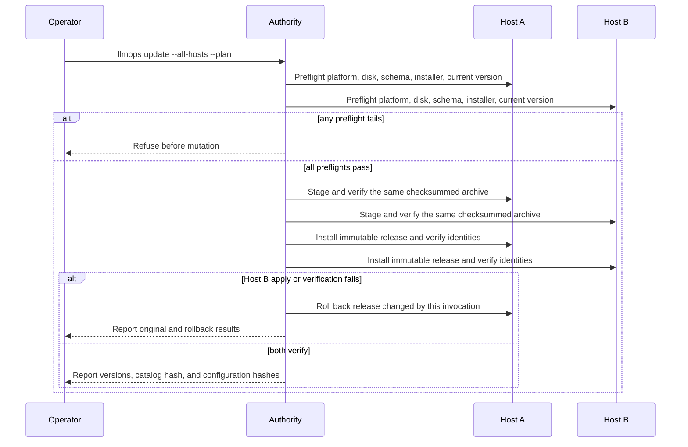
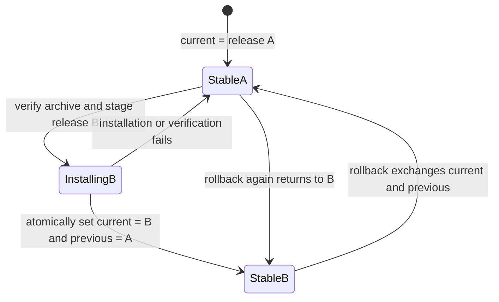
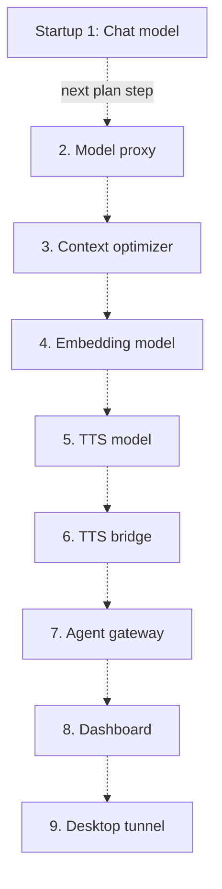
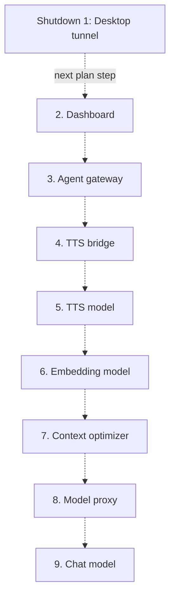
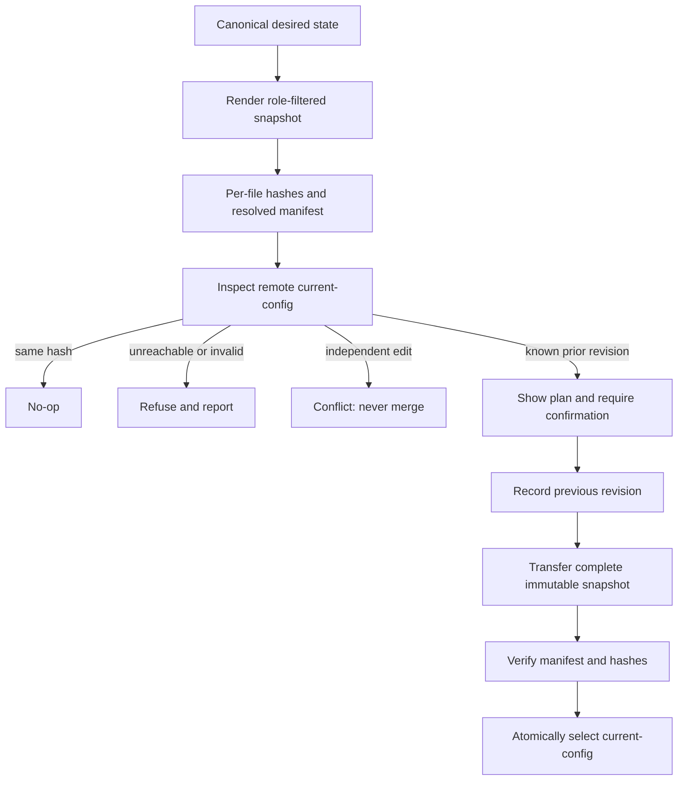

# LLM-Ops-Kit Engineering Evidence

- **Evidence date:** 2026-07-20
- **Release candidate:** `0.9.0b5`
- **Runtime artifact source commit:** `6989f97`
- **Release archive SHA-256:** `8169e9c6f953a3036c1c5e30aa2868ac4e9ab704172c5074c184d71140076b8f`

## Purpose

This report explains the architectural invariants of LLM-Ops-Kit and the acceptance evidence supporting them. It is intended for engineers who have not worked on the project. It does not publish private addresses, credentials, model paths, voice samples, prompts, or site-specific configuration.

LLM-Ops-Kit is a lightweight control plane for heterogeneous AI services. It coordinates existing process managers, model engines, agents, proxies, bridges, dashboards, and tunnels through typed adapters. It does not replace launchd, SSH, model runtimes, containers, secret stores, or agent frameworks.

The central correctness argument is that LLM-Ops-Kit separates desired state, planning, execution, observation, and product-specific lifecycle behavior. Mutations are derived from validated configuration, represented as inspectable plans, executed by typed adapters, bounded by dependency and rollback rules, and verified against immutable release and configuration identities.

## Evidence Scope

The full two-host and protocol acceptance baseline was collected against `0.9.0b4`. It included exact-artifact installation on Apple Silicon and Intel macOS, rollback and return, bidirectional remote lifecycle operations, a dependency-ordered cold stop/start, model-proxy chat, 1,024-dimensional embeddings, cloned-voice TTS, agent services, dashboards, optimization services, and the Desktop tunnel.

Release candidate `0.9.0b5` adds one narrow operational correction: CLI and Textual TUI status now use the same catalog-aware collector. A regression proves that a deliberately peer-unobservable Desktop tunnel is reported as `authority-only`, not `unreachable`. The runtime artifact precheck passed 120 tests. The current source suite passes 121 tests after adding an explicit exact-reversal assertion for full-stack start and stop plans. The exact checksummed artifact was installed on both live macOS hosts through coordinated update, the shared catalog and host-specific configuration hashes remained unchanged, and all observable services remained running.

## Topology And Trust Boundary



The authority is the only source of desired state. Trusted control hosts receive the complete secret-free topology needed to plan and observe authorized operations. Component hosts receive only the profiles required for their role. Secret values, model weights, runtime logs, state databases, and agent data are excluded from synchronization.

This arrangement is correct for a small trusted LAN control plane because it avoids an unsolved distributed-consensus problem. Independent remote edits are detected as drift and refused rather than merged. Operators therefore get deterministic behavior without pretending that several writable replicas can reconcile arbitrary changes safely.

## Architectural Invariants

| Invariant | Enforcement mechanism | Acceptance evidence | Failure prevented |
|---|---|---|---|
| One desired-state authority | Canonical configuration is rendered into checksummed host revisions; remote edits are never merged | A deliberate remote edit produced `conflict`; reconciliation refused replacement; restoring the backup returned validation to clean | Split-brain configuration and silent loss of an operator change |
| Plans precede mutations | CLI and TUI use the same planner and operation model; TUI displays the equivalent CLI command before confirmation | Headless TUI tests verify equivalent commands and cancellation without configuration mutation | A UI-specific orchestration path with different behavior |
| Dependencies determine order | Start uses topological order; stop uses reverse topological order; cycles are rejected during validation | Unit tests verify dependency-first start and reverse stop; live cold-cycle acceptance stopped and started the complete stack in the expected order | Starting consumers before providers or stopping providers under active consumers |
| Failure cleanup is bounded | The executor records components started by the current invocation and only stops that set on failure | Regression injects a failed start while a pre-existing service remains running | A failed operation taking down unrelated healthy services |
| Releases are immutable and reversible | Each release is installed under a versioned directory; `current` and `previous` are atomically selected | Both hosts rolled back from `0.9.0b4` to `0.9.0b3` and returned; the `0.9.0b5` update retained `0.9.0b4` as `previous` | In-place partial upgrades and unrecoverable runtime replacement |
| Coordinated update is all-or-rollback | All selected hosts preflight before apply; the same verified archive is staged; apply is sequential; changed hosts roll back if a later host fails | Tests inject second-host failure and verify rollback of the first; the live two-host update installed one archive and verified version/config/catalog identity | Silent mixed-version operation after a partial update |
| Configuration selection is atomic | Accepted revisions are immutable and `current-config` selects one revision; replacement creates a backup | Reconciliation applied once, a second plan was a no-op, and manually divergent content was refused | Processes reading a half-written configuration tree |
| Observation respects authorization | The observer catalog marks hosts as peer-observable or authority-only; status distinguishes policy from transport failure | Both trusted hosts produced the same component set; the local Desktop tunnel was `authority-only`; `0.9.0b5` made CLI and TUI use the same collector | False outage alarms for resources a peer is intentionally unable to inspect |
| Product integrations do not invade the core | Versioned adapters own lifecycle details; planner, executor, CLI, and TUI consume the registry | Six built-in adapters passed discovery and conformance; a fixture adapter registers without core parser or planner changes | Vendor-specific conditionals spreading through orchestration code |
| Runtime Python is application-owned | UV installs locked dependencies into each immutable release and wrappers use absolute release paths | Exact artifacts installed without Git, system Python, Conda activation, shell-profile sourcing, or a checkout on both macOS architectures | Launchd and SSH selecting an accidental or incompatible Python environment |
| Proxies are observational, not mutating | Model-proxy forwards the original request and performs template rendering only in a diagnostic path | Clean-artifact proxy rendering and protocol acceptance passed while raw upstream behavior remained unchanged | Debug tooling changing production prompts |

## Update Protocol



The protocol is safe because preflight is complete before the first mutation, every host receives the same content-addressed input, and rollback scope is limited to hosts changed by that invocation. The protocol is observable because success includes runtime, catalog, and configuration identities rather than relying on process exit status alone.

The protocol is deliberately sequential. For a small local AI topology, bounded interruption and straightforward rollback are more valuable than parallel rollout complexity. Sequential application also makes the changed-host set unambiguous when a later host fails.

## Runtime Rollback



Rollback is a pointer exchange between immutable releases, not reconstruction from a mutable working directory. This matters because the old executable, package environment, templates, and native resources remain a coherent unit. The configuration tree is separate durable state, so normal runtime rollback does not erase operator configuration or agent data.

## Accepted Start And Stop Ordering





The dotted arrows show the accepted plan sequence, not additional dependency edges. Independent branches may have more than one valid topological ordering, but once the planner selects a deterministic startup order, full-stack shutdown reverses that exact list. The accepted nine-component stop plan was mechanically compared with the start plan and matched it in reverse.

The planner treats components as a directed acyclic graph. Starting a target includes missing upstream dependencies. Stopping a component with active dependents requires confirmation, force, or cascade. Restart affects only the target by default, which allows a model engine to be replaced or bounced without restarting the agent and proxy layers.

Correctness has two parts. First, graph validation rejects cycles and unknown dependencies before execution, so an order always exists. Second, the executor tracks pre-existing state. If a multi-component start fails, it reverses only starts completed by that invocation, preserving services that were already healthy.

## Configuration Reconciliation



Reconciliation is idempotent because identical hashes produce a no-op. It is conservative because invalid, unreachable, or independently modified targets block application. It is recoverable because accepted snapshots are immutable, the prior selection is recorded, and the active selection changes only after the complete snapshot verifies.

Trusted controllers receive a complete secret-free catalog so each can produce the same global status and authorized plans. Runtime component hosts still consume host-specific configuration revisions, which is why their configuration hashes legitimately differ while their shared catalog hash agrees.

## Status Semantics

Status is not a single Boolean. The significant states are:

- `running`: the authorized observer reached the owning adapter and the adapter reported success.
- `not-running`: the target was observable but inactive.
- `unreachable`: an authorized observation route exists but transport failed.
- `authority-only`: the catalog knows the component, but the current peer is intentionally not authorized or able to observe it.
- `disabled`: canonical configuration excludes the component from lifecycle execution.
- `error`: observation ran but failed outside the normal inactive or transport cases.

This distinction prevents policy from being misreported as failure. In `0.9.0b5`, CLI and TUI call the same catalog-aware collection function. The regression specifically models a Desktop tunnel on a non-peer-observable host and requires `authority-only` in the shared payload.

## Acceptance Record

| Evidence | Result |
|---|---|
| Source precheck | Runtime artifact passed 120 tests; current source passes 121 after adding the exact reverse-order regression |
| Clean distribution | Runtime-only archive built from clean commit `6989f97` |
| Release identity | Version `0.9.0b5`; archive SHA-256 `8169e9c6f953a3036c1c5e30aa2868ac4e9ab704172c5074c184d71140076b8f` |
| macOS packaging baseline | Exact-artifact normal and minimal installation previously passed on Apple Silicon and Intel isolated users |
| Live coordinated update | Both managed hosts advanced from `0.9.0b4` to `0.9.0b5`; both retained `0.9.0b4` as `previous` |
| Configuration preservation | Shared catalog hash and both host-specific configuration hashes were unchanged after update |
| Runtime continuity | Eight remotely observable components remained running; the local Desktop tunnel remained correctly classified as `authority-only` |
| Cross-host lifecycle baseline | Model, proxy, bridge, and complete dependency-ordered stack operations passed in both directions |
| Protocol baseline | Chat, 1,024-dimensional embeddings, WAV TTS, gateway, dashboard, optimization proxy, and tunnel checks passed |
| Reconciliation | Apply, idempotent no-op, conflict refusal, backup restoration, and clean manifest verification passed |
| Failure injection | Partial-start cleanup, second-host update failure rollback, tampered artifact rejection, unreachable host handling, and invalid configuration refusal passed |

## Why The Evidence Is Sufficient

Unit and integration tests establish local invariants such as graph ordering, bounded rollback, adapter conformance, schema rejection, artifact verification, and interface equivalence. Exact-artifact installation establishes that the release does not depend on ignored checkout residue or a developer Python environment. Two-host acceptance establishes that SSH addressing, absolute runtime paths, role-filtered configuration, trusted peer control, and shared catalog semantics work outside fake transports. Protocol tests establish that successful lifecycle status corresponds to usable model and agent endpoints rather than merely existing processes.

No single layer is treated as conclusive. The evidence chain is configuration identity, plan behavior, lifecycle result, health observation, and protocol response. That layered approach is why live acceptance exposed earlier defects in runtime wrapper configuration selection and SSH `control_host` use even though narrower tests had passed.

## Non-Claims And Remaining Gates

- macOS is the supported beta platform. Linux and systemd work remain experimental and are not publication claims.
- LLM-Ops-Kit is not a high-availability consensus system. It intentionally uses one desired-state authority and conflict refusal.
- `authority-only` does not prove that the component is running; it states that the current peer is not an authorized observer. The authority must inspect that component.
- The current beta does not download models, install arbitrary engines, edit raw secrets, or autonomously remediate failures.
- The Textual TUI is an on-demand client, not a daemon. A future WebUI must use the same control interfaces rather than create a second executor.
- The `0.9.0b5` branch and artifact have not been pushed, tagged, or published. Explicit maintainer approval and green macOS CI remain release gates.

## Reproduction Outline

An independent maintainer can reproduce the public evidence without the private topology:

```bash
scripts/precheck
python scripts/build-release.py --output-dir /tmp/llmops-release
shasum -a 256 /tmp/llmops-release/LLM-Ops-Kit-*.tar.xz
llmops doctor --probe
llmops status --json
llmops plan --action start --json
llmops config reconcile --all-hosts --plan --json
llmops update --all-hosts --plan --archive /path/to/release.tar.xz --checksum-file /path/to/release.tar.xz.sha256 --json
```

Fresh installation, rollback, uninstall, purge, TUI, lifecycle, and protocol checks are enumerated in the project operator and E2E checklists. Site-specific addresses and profiles should be supplied through private canonical configuration, never embedded in the release artifact or this report.

## Source Documents

- [Architecture](./ARCHITECTURE.md)
- [Configuration and reconciliation](./CONFIGURATION.md)
- [Deployment overview](./DEPLOYMENT_OVERVIEW.md)
- [Upgrade and rollback](./UPGRADE_AND_ROLLBACK.md)
- [Operator checklist](./OPERATOR_CHECKLIST.md)
- [Manual E2E checklist](./MANUAL_E2E_TEST_CHECKLIST.md)

The site-specific acceptance record remains private operational evidence and is intentionally not part of the public repository.
